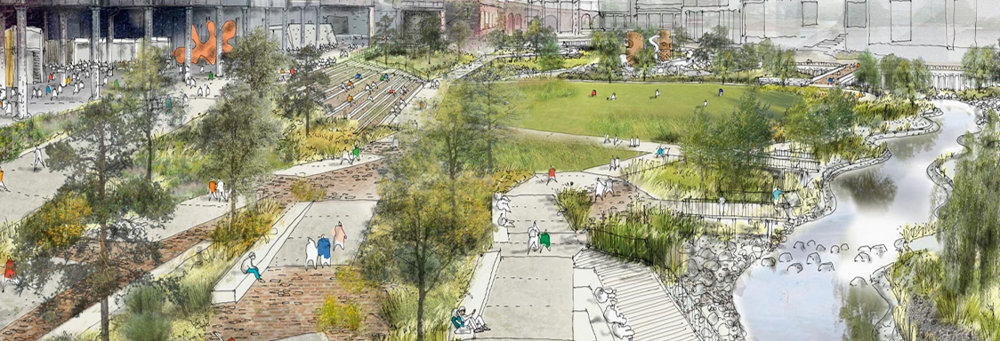
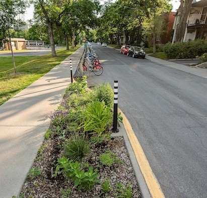
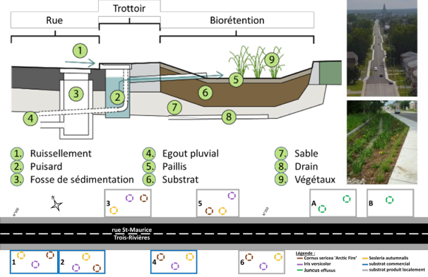
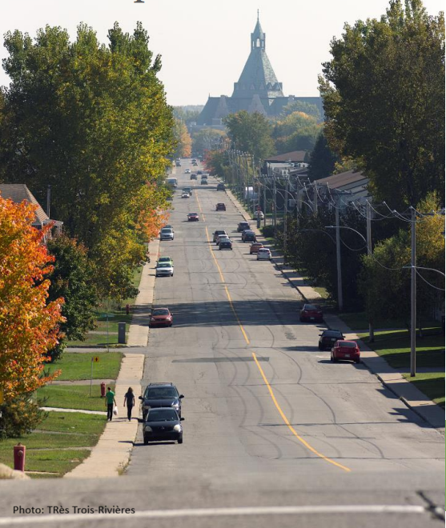
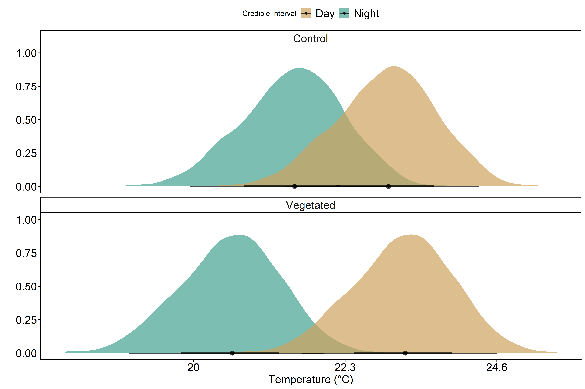
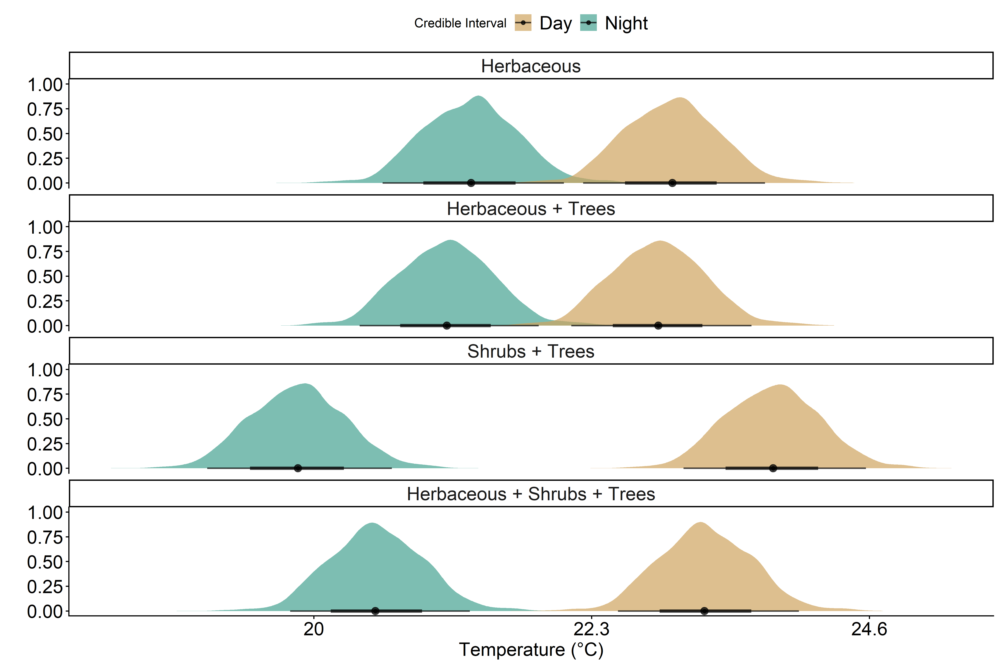
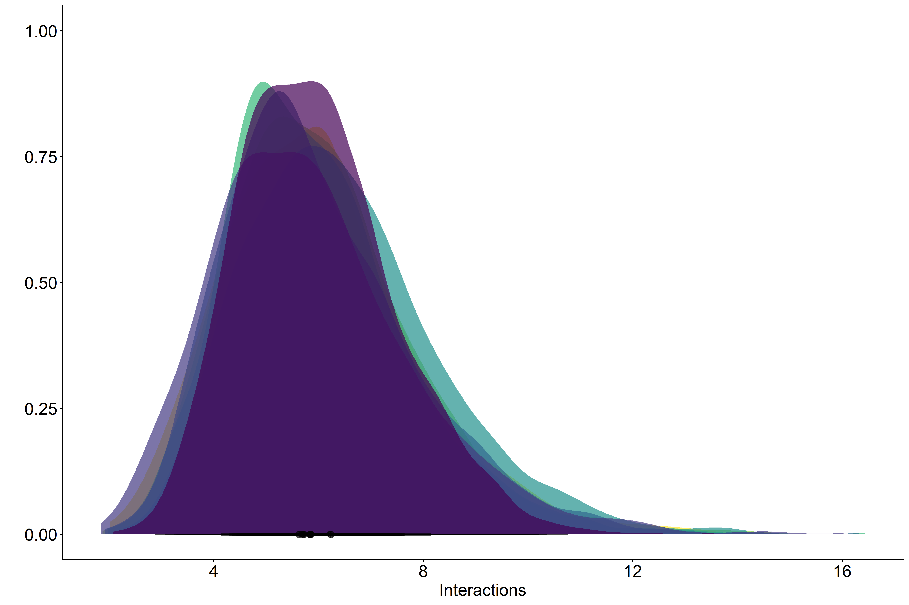
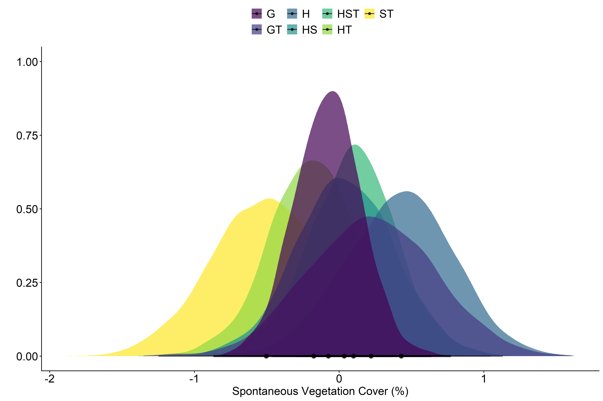
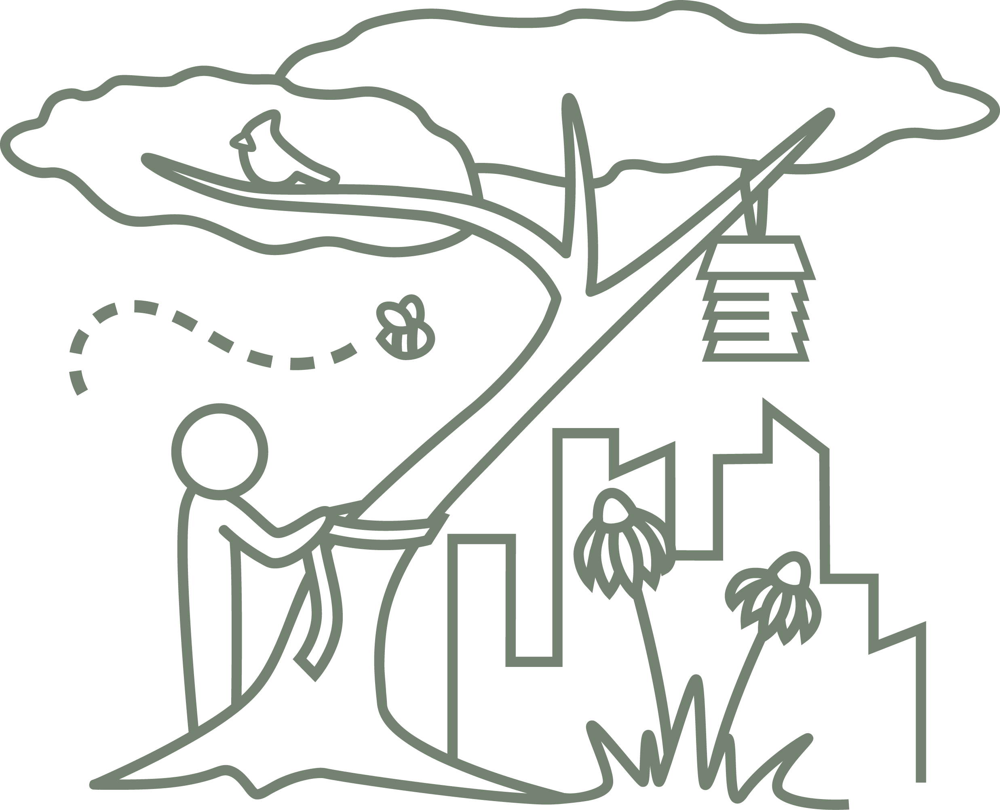

## Green infrastructure plays many roles in our cities

::: {layout="[[-1], [1], [-1]]"}
{fig-align="center"}
:::

## Vegetated curb cuts are designed for stormwater management 

:::: {.columns}

:::: {.column}

::: {layout="[[-1], [1], [-1]]"}

:::

::::

:::: {.column}

::: {layout="[[-1], [1], [-1]]"}

{width=40%}

:::

::::

::::

## Vegetated curb cuts have the potential for co-benefits



## Rue St Maurice as a case study 

:::: {layout="[[-1], [1], [-1]]"}
::: {.columns}

::: {.column width="40%"}

- 54 curb cuts were installed in 2018
- 20,000 plants were planted in 2018 and monitored for 3 years after
- 7 different designs
::: 

::: {.column}

{width=80% fig-align="right"}

:::

:::

::::

## What is the impact of vegetated curb cut presence and design on different co-benefits? 

1. Temperature 

1. Pollinator (bee) interactions 

1. Vegetation management

## Temperature is cooler in vegetated curb-cuts at night

{fig-align="center"}

## Shrubs mediate night-time temperature {.smaller} 

{fig-align="center"}

## Design does not cause major differences in pollinator interactions 

{fig-align="center"} 

## Trees and shrubs are most persistent vegetation

{fig-align="center"}

## {background-image="presentation_imgs/IMG_1257.jpeg"}

:::: {layout="[[-1], [1], [-1]]"}
::: columns
::: {.column width="90%"}
::: {style="background-color: #c0c0beff; opacity: 80%"}

**Vegetated curb cuts have benefits for human and non-human residents in cities**

- vegetated curb cuts have co-benefits
- design of curb cuts impacts co-benefits
- small scale green infrastructure affects night-time temperature (by many degrees!)
- shrubs are providing cooling and mangement benefits
:::
:::
:::
::::

## Thank you! 

::: columns
::: {.column width="60%"}
{width=30%}

{width="70%"}
:::

::: {.column width="40%"}
::: {layout="[[-1], [1], [-1]]"}
-   Cami Loignon-Gagnon
-   Ville de Trois-Rivières
-   Thi-Thanh Hiên Pham (UQAM)
-   Danielle Dagenais (UdeM)
:::
:::
:::

## Questions ?

::: {.columns}

::: {.column width="50%"}
{width=80%}

::: 

::: {.column width="50%"}
{width=80%}
:::